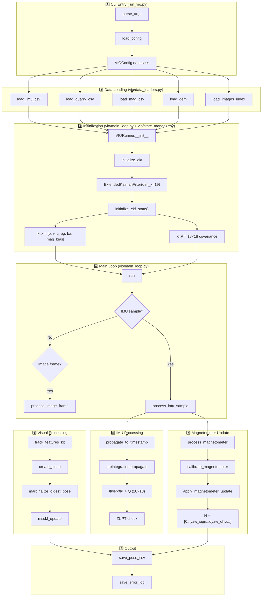

# VIO System Flow Diagram (v3.9.9)

## Command Execution Flow

```
run_vio.py --config ... --imu ... --quarry ... --mag ... --dem ... --output ...
```

---

## 🔄 Complete Process Flow



---

## 📁 File-by-File Execution Order

### Phase 1: CLI & Configuration
| Step | File | Function | Description |
|------|------|----------|-------------|
| 1 | `run_vio.py` | `main()` | Entry point |
| 2 | `run_vio.py` | `parse_args()` | Parse CLI arguments |
| 3 | `vio/config.py` | `load_config()` | Load YAML → VIOConfig |

### Phase 2: Data Loading
| Step | File | Function | Description |
|------|------|----------|-------------|
| 4 | `vio/data_loaders.py` | `load_imu_csv()` | Load 123,087 IMU samples |
| 5 | `vio/data_loaders.py` | `load_quarry_csv()` | Load GGA flight log |
| 6 | `vio/data_loaders.py` | `load_mag_csv()` | Load 6,160 mag samples |
| 7 | `vio/data_loaders.py` | `load_dem()` | Load Copernicus DEM |
| 8 | `vio/data_loaders.py` | `load_images_index()` | Load 4,611 image indices |

### Phase 3: EKF Initialization
| Step | File | Function | Description |
|------|------|----------|-------------|
| 9 | `vio/main_loop.py` | `VIORunner.__init__()` | Create runner |
| 10 | `vio/main_loop.py` | `initialize_ekf()` | Setup EKF |
| 11 | `vio/ekf.py` | `ExtendedKalmanFilter()` | Create 19D state |
| 12 | `vio/state_manager.py` | `initialize_ekf_state()` | Set initial state |
| 13 | `vio/state_manager.py` | `initialize_covariance()` | Create 18×18 P matrix |

### Phase 4: Main Loop (per IMU sample)
| Step | File | Function | Description |
|------|------|----------|-------------|
| 14 | `vio/main_loop.py` | `run()` | Main event loop |
| 15 | `vio/main_loop.py` | `process_imu_sample()` | Handle IMU data |
| 16 | `vio/propagation.py` | `propagate_to_timestamp()` | Propagate state |
| 17 | `vio/imu_preintegration.py` | `propagate()` | Preintegration |
| 18 | `vio/imu_preintegration.py` | `compute_error_state_jacobian()` | Compute Φ (18×18) |
| 19 | `vio/imu_preintegration.py` | `compute_error_state_process_noise()` | Compute Q (18×18) |

### Phase 5: Measurement Updates
| Step | File | Function | Description |
|------|------|----------|-------------|
| 20 | `vio/measurement_updates.py` | `apply_magnetometer_update()` | Yaw update |
| 21 | `vio/measurement_updates.py` | `apply_height_update()` | DEM altitude |
| 22 | `vio/measurement_updates.py` | `apply_velocity_update()` | VO velocity |
| 23 | `vio/msckf.py` | `msckf_update()` | Visual constraint |

### Phase 6: Clone Management
| Step | File | Function | Description |
|------|------|----------|-------------|
| 24 | `vio/main_loop.py` | `create_clone()` | Add camera pose |
| 25 | `vio/main_loop.py` | `marginalize_oldest_pose()` | Remove old clone |

---

## 📊 State Vector Structure

```
kf.x (19D nominal state):
┌────────────────────────────────────────┐
│ [0:3]   Position (p)        - ENU m    │
│ [3:6]   Velocity (v)        - m/s      │
│ [6:10]  Quaternion (q)      - w,x,y,z  │
│ [10:13] Gyro Bias (bg)      - rad/s    │
│ [13:16] Accel Bias (ba)     - m/s²     │
│ [16:19] Mag Bias (hard_iron) - norm    │ ← NEW v3.9.7
│ [19:26] Clone 0 (q + p)     - 7D       │
│ [26:33] Clone 1 ...                    │
│ ...                                     │
└────────────────────────────────────────┘

kf.P (18D + 6N error state covariance):
┌────────────────────────────────────────┐
│ [0:3]   δp   - Position error          │
│ [3:6]   δv   - Velocity error          │
│ [6:9]   δθ   - Rotation error (so(3))  │
│ [9:12]  δbg  - Gyro bias error         │
│ [12:15] δba  - Accel bias error        │
│ [15:18] δmag - Mag bias error          │ ← NEW v3.9.7
│ [18:24] Clone 0 error (δθ + δp)        │
│ ...                                     │
└────────────────────────────────────────┘
```

---

## ⏱️ Timing Summary

| Phase | Duration | Samples |
|-------|----------|---------|
| IMU Propagation | ~400 Hz | 123,087 |
| Image Processing | ~10 Hz | 4,611 |
| Mag Updates | ~20 Hz | 5,549 (accepted) |
| MSCKF Updates | Variable | 6,543 (11.1%) |
| Total Runtime | ~450 sec | - |
