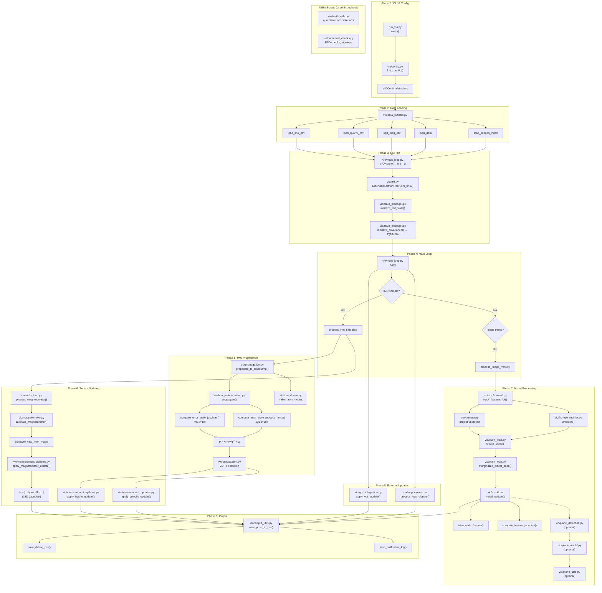

# VIO System Complete Flow (v3.9.9)

## 📂 vio/ Scripts Inventory (25 files)

| # | Script | Used? | Phase | Description |
|---|--------|-------|-------|-------------|
| 1 | `__init__.py` | ✅ | - | Package initialization, version info |
| 2 | `config.py` | ✅ | 1 | VIOConfig dataclass, YAML loader |
| 3 | `data_loaders.py` | ✅ | 2 | IMU/MAG/VPS/DEM/Image loading |
| 4 | `ekf.py` | ✅ | 3 | ExtendedKalmanFilter class (19D) |
| 5 | `state_manager.py` | ✅ | 3 | State initialization, covariance |
| 6 | `main_loop.py` | ✅ | 4 | VIORunner orchestrator |
| 7 | `propagation.py` | ✅ | 5 | IMU propagation, ZUPT |
| 8 | `imu_preintegration.py` | ✅ | 5 | Forster preintegration |
| 9 | `imu_driven.py` | ✅ | 5 | IMU-driven mode handler |
| 10 | `magnetometer.py` | ✅ | 6 | Mag calibration, yaw computation |
| 11 | `measurement_updates.py` | ✅ | 6 | Mag/Height/Velocity updates |
| 12 | `vio_frontend.py` | ✅ | 7 | Feature tracking (KLT) |
| 13 | `msckf.py` | ✅ | 7 | Multi-State Constraint KF |
| 14 | `camera.py` | ✅ | 7 | Camera projection models |
| 15 | `fisheye_rectifier.py` | ✅ | 7 | Kannala-Brandt rectification |
| 16 | `vps_integration.py` | ✅ | 8 | VPS/GPS updates |
| 17 | `loop_closure.py` | ✅ | 8 | Yaw drift correction |
| 18 | `output_utils.py` | ✅ | 9 | Debug output, CSV writers |
| 19 | `math_utils.py` | ✅ | * | Math helpers (quaternions, etc) |
| 20 | `numerical_checks.py` | ✅ | * | Covariance PSD checks, tripwires |
| 21 | `plane_detection.py` | ⚠️ | 7 | RANSAC plane fitting (optional) |
| 22 | `plane_msckf.py` | ⚠️ | 7 | Plane-constrained MSCKF (optional) |
| 23 | `plane_utils.py` | ⚠️ | 7 | Plane geometry utilities (optional) |
| 24 | `event_driven.py` | ❌ | N/A | **NOT USED** (legacy) |
| 25 | `trn.py` | ❌ | N/A | **NOT USED** (TRN disabled) |

**Legend:** ✅ Active | ⚠️ Optional/Conditional | ❌ Not Used

---

## 🔄 Detailed Process Flow



---

## 📋 Phase-by-Phase Script Usage

### Phase 1: CLI & Configuration
| Script | Functions Called |
|--------|------------------|
| `run_vio.py` | `main()`, `parse_args()` |
| `vio/config.py` | `load_config()` → `VIOConfig` |

### Phase 2: Data Loading
| Script | Functions Called |
|--------|------------------|
| `vio/data_loaders.py` | `load_imu_csv()`, `load_quarry_csv()`, `load_mag_csv()`, `load_vps_csv()`, `load_dem()`, `load_images_index()`, `load_ground_truth()` |

### Phase 3: EKF Initialization
| Script | Functions Called |
|--------|------------------|
| `vio/main_loop.py` | `VIORunner.__init__()`, `initialize_ekf()` |
| `vio/ekf.py` | `ExtendedKalmanFilter(dim_x=19)`, `apply_correction()` |
| `vio/state_manager.py` | `initialize_ekf_state()`, `initialize_covariance()`, `get_num_clones()` |

### Phase 4: Main Loop
| Script | Functions Called |
|--------|------------------|
| `vio/main_loop.py` | `run()`, `process_imu_sample()`, `process_image_frame()` |

### Phase 5: IMU Propagation
| Script | Functions Called |
|--------|------------------|
| `vio/propagation.py` | `propagate_to_timestamp()`, `propagate_error_state_covariance()` |
| `vio/imu_preintegration.py` | `propagate()`, `compute_error_state_jacobian()`, `compute_error_state_process_noise()`, `snapshot_jacobians()` |
| `vio/imu_driven.py` | `IMUDrivenProcessor.process_batch()` (alternative mode) |

### Phase 6: Sensor Updates
| Script | Functions Called |
|--------|------------------|
| `vio/magnetometer.py` | `calibrate_magnetometer()`, `compute_yaw_from_mag()`, `MagLowPassFilter` |
| `vio/measurement_updates.py` | `apply_magnetometer_update()`, `apply_height_update()`, `apply_velocity_update()`, `apply_plane_constraint_update()` |

### Phase 7: Visual Processing
| Script | Functions Called |
|--------|------------------|
| `vio/vio_frontend.py` | `track_features_klt()`, `extract_features_grid()` |
| `vio/camera.py` | `project()`, `unproject()`, `CameraModel` |
| `vio/fisheye_rectifier.py` | `FisheyeRectifier.undistort()` |
| `vio/msckf.py` | `msckf_update()`, `triangulate_feature()`, `compute_feature_jacobian()`, `nullspace_projection()` |
| `vio/plane_detection.py` | `detect_planes()` (optional) |
| `vio/plane_msckf.py` | `plane_msckf_update()` (optional) |
| `vio/plane_utils.py` | `fit_plane()`, `point_to_plane_distance()` (optional) |

### Phase 8: External Updates
| Script | Functions Called |
|--------|------------------|
| `vio/vps_integration.py` | `apply_vps_update()`, `apply_height_update()`, `compute_vps_innovation()` |
| `vio/loop_closure.py` | `process_loop_closure()`, `LoopClosureHandler` |

### Phase 9: Output
| Script | Functions Called |
|--------|------------------|
| `vio/output_utils.py` | `save_pose_to_csv()`, `save_debug_csv()`, `save_calibration_log()`, `DebugWriters`, `print_error_statistics()` |

### Utility Scripts (used throughout)
| Script | Functions Called |
|--------|------------------|
| `vio/math_utils.py` | `quat_mult()`, `quat_to_rot()`, `skew_symmetric()`, `angle_wrap()` |
| `vio/numerical_checks.py` | `check_covariance_psd()`, `enforce_covariance_symmetry()`, `check_file_being_used()` |
| `vio/__init__.py` | Package metadata, version info |

---

## ❌ Unused Scripts

| Script | Reason |
|--------|--------|
| `vio/event_driven.py` | Legacy code, replaced by `main_loop.py` |
| `vio/trn.py` | TRN (Terrain Referenced Navigation) disabled in config |

---

## 📊 State Vector (v3.9.9)

```
Nominal State (19D):
┌─────────────────────────────────────┐
│ [0:3]   p      - Position (ENU)     │
│ [3:6]   v      - Velocity           │
│ [6:10]  q      - Quaternion         │
│ [10:13] bg     - Gyro bias          │
│ [13:16] ba     - Accel bias         │
│ [16:19] mag    - Mag bias (NEW)     │
│ [19:26] Clone₀ - Camera pose 0      │
│ [26:33] Clone₁ - Camera pose 1      │
│ ...                                 │
└─────────────────────────────────────┘

Error State (18D + 6N):
┌─────────────────────────────────────┐
│ [0:3]   δp    - Position error      │
│ [3:6]   δv    - Velocity error      │
│ [6:9]   δθ    - Rotation error      │
│ [9:12]  δbg   - Gyro bias error     │
│ [12:15] δba   - Accel bias error    │
│ [15:18] δmag  - Mag bias error (NEW)│
│ [18:24] δC₀   - Clone 0 error       │
│ ...                                 │
└─────────────────────────────────────┘
```
